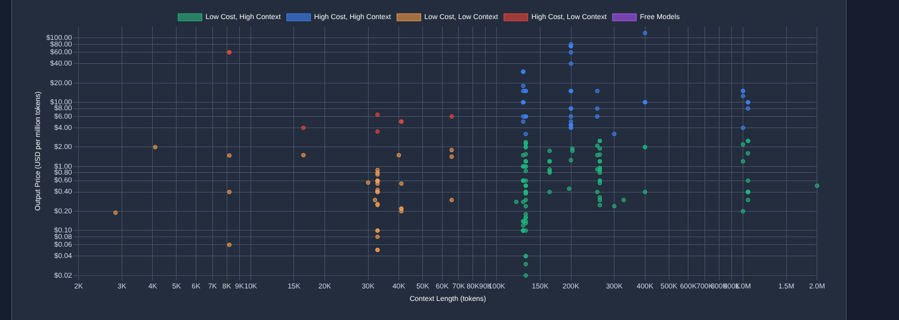

# OpenRouter Tool-Calling Models Cost Analysis (Nov 8, 2025)

A point-in-time cost comparison analysis of LLM APIs with tool calling capabilities, sourced from OpenRouter's API.

Pricing data obtained directly from OpenAI API on Nov 8th 2025.

## Overview

This repository contains a quadrant analysis of 218 models in OpenRouter's library that support tool calling - a critical feature for agentic workflows, MCP (Model Context Protocol) implementations, and multi-tool orchestration systems.

## Key Findings

The analysis divides models into quadrants based on:
- **Price per token** (cost-effectiveness)
- **Context window size** (capability)

This creates a framework for identifying:
- Cost-effective models for high-volume tool calling
- Premium tier models for complex agentic tasks
- The diversity between legacy tool-calling models and recent market entrants

## Relevance

Tool calling is essential for:
- Agentic AI systems
- MCP (Model Context Protocol) implementations
- Multi-tool orchestration
- Function calling and API integration

## Data Source

- **Source**: OpenRouter API
- **Date**: November 8, 2025
- **Models Analyzed**: 218 with tool calling support
- **Note**: Prices are subject to ongoing fluctuation according to OpenRouter's live pricing

## Purpose

Created for personal analysis when evaluating LLM options for agentic workflows, shared publicly in case others find the quadrant analysis helpful for model selection decisions.

## Analysis Files

- `data/` - Raw data and processed datasets
- `analysis/` - Quadrant analysis and visualizations
- `scripts/` - Data collection and analysis scripts

---

*This is a snapshot analysis. For current pricing, always refer to [OpenRouter's live API](https://openrouter.ai/).*