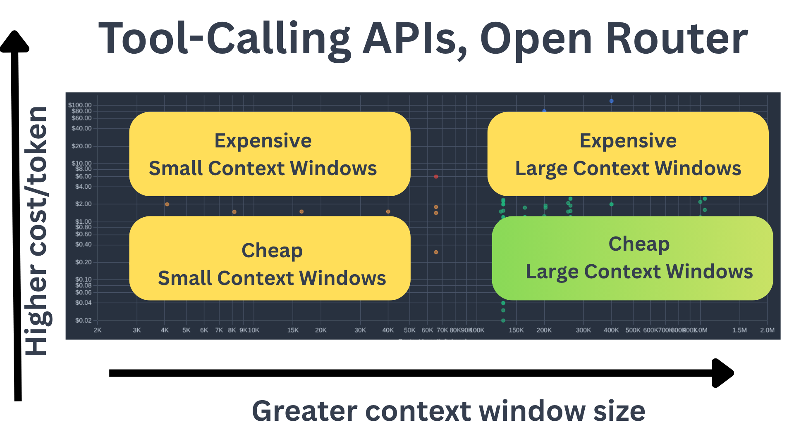

# LLM API Cost Comparison: Tool-Calling Capable Models (Data: Open Router, Nov 8th, 2025)

Tool-calling is arguably an essential model requirement for agentic AI applications. 

The LLM landscape is growing quickly. By making many models available for inference, Open Router provides a rich source of parametric info about models' pricing as well as technical information like their maximum context windows.

This desk research was undertaken to try to get clarity on the question: if I need an LLM that can reliably call tools, what are my budget options and what are my "top dollar" go-tos?

Benchmark performance is also essential information, of course; but API pricing is a significant variable in decision-making.

Pricing data obtained directly from OpenAI API on Nov 8th 2025.

## Notes On Quadrants

At the time of running this, Open Router retrieved a whopping 218 models which were were listed as supporting tool use - confirming my suspicion that there really are an awful lot of LLMs nowadays. 

Some model familys are "household names" (OpenAI, Anthropic, etc); while others could be characterised as at the periphery of mainstream adoption (in the West, that is) but making inroads, quickly, among serious AI users.

Both context windows and pricing are remarkably variable which has significant ramifications for workflow suitability: the difference between a 33K token context window (some Mistral variants) and a 2 million token marketed window is 60-fold.

Likewise at $75 PMT on output (per million tokens), Opus is more than 300X the price of Jamba Mini ($0.20!) It could be argued that agentic workflows might lend themselves to a more even spread of input and output token usage than, say, conversational prompting: the LLM is responding with actions and the user is rapidly providing feedback. A median between input and output token pricing was also calculated.

Rough parametets were taken to stratify this list into quadrants with no intended meaning as to which denotes better value -  as most users' primary intention when buying LLM API usage is not maximising their dollar/context window spend (right?).

To cut to the chase:

The most "desirable" quadrant (low cost, high context window), bottom right *(green scatter plots) is:

- Context window > 150K tokens 
- Price per million tokens of output < $2

The outlier: Grok 4 fast with a claimed context window of 2 million tokens and ccosting only $0.30/$0.50 (input/output per million tokens).

Also in this relative sweet spot:

- Gemini 2.5 
- GPT 4 and GPT 5 Mini and Nano 
- Qwen 3 
- Z.AI GLM 

## Overview

This repository contains a quadrant analysis of 218 models in OpenRouter's library that support tool calling - a critical feature for agentic workflows, MCP (Model Context Protocol) implementations, and multi-tool orchestration systems.

## Key Findings

The analysis divides models into quadrants based on:
- **Price per token** (cost-effectiveness)
- **Context window size** (capability)

This creates a framework for identifying:
- Cost-effective models for high-volume tool calling
- Premium tier models for complex agentic tasks
- The diversity between legacy tool-calling models and recent market entrants

## Relevance

Tool calling is essential for:
- Agentic AI systems
- MCP (Model Context Protocol) implementations
- Multi-tool orchestration
- Function calling and API integration

## Data Source

- **Source**: OpenRouter API
- **Date**: November 8, 2025
- **Models Analyzed**: 218 with tool calling support
- **Note**: Prices are subject to ongoing fluctuation according to OpenRouter's live pricing

## Purpose

Created for personal analysis when evaluating LLM options for agentic workflows, shared publicly in case others find the quadrant analysis helpful for model selection decisions.

## Analysis Files

- `data/` - Raw data and processed datasets
- `analysis/` - Quadrant analysis and visualizations
- `scripts/` - Data collection and analysis scripts

---

*This is a snapshot analysis. For current pricing, always refer to [OpenRouter's live API](https://openrouter.ai/).*